# Data domains (internal architecture)

> **Maintainer / internal doc.** Maps each public-facing domain to its sources, typed
> results, units, capabilities, and known limitations. Users should start from `docs/api.md`
> and the tutorials; this doc is for maintainers who need the full source-strategy picture.

## Domain summary

| Domain | Namespace | Unit | Failover? | Sources (in priority order) | Granularity |
|--------|-----------|------|-----------|---------------------------|-------------|
| Prices | `vnfin.prices` | VND | Yes | SSI -> VNDirect -> VPS -> Pinetree | D1 (guaranteed); intraday capability-gated |
| Fundamentals | `vnfin.fundamentals` | raw VND | Yes | VNDirect -> CafeF | ANNUAL / QUARTER |
| Funds | `vnfin.funds` | VND/unit | No (single source) | Fmarket | NAV history + fund list |
| Indices | `vnfin.indices` | points | Yes (value); No (constituents) | VPS/SSI/VNDirect (value); SSI iBoard (constituents) | D1 |
| Equities | `vnfin.equities` | — (reference metadata) | No (single source) | SSI iBoard (`/stock/group/{board}`) | current universe snapshot per board (#167) |
| Corp-actions | `vnfin.corp_actions` | VND/share (cash) | No (single source) | VSDC scrape (`vsd.vn/vi/ad/{id}`) | per-issuer cash-dividend history (#163) |
| Gold (VN) | `vnfin.gold.vn` | VND/luong | No (pick one) | BTMC or PNJ | spot only |
| Gold (world) | `vnfin.gold.world` | USD/oz | Yes (history) | CurrencyApi (default); Stooq (opt-in) | daily EOD |
| Crypto | `vnfin.crypto` | USD | Yes | Binance -> Coinbase | D1 + intraday |
| FX | `vnfin.fx` | VND per 1 unit | Yes | open.er-api -> Vietcombank (spot); World Bank (history) | spot via `get_rate`; annual USD/VND history via `history()` (#159) |
| Macro | `vnfin.macro` | indicator-specific | Yes | WorldBank -> IMF -> DBnomics; FRED (BYOK, opt-in) | annual (primary); quarterly/monthly varies |
| News | `vnfin.news` | — | No (BYOK) | Alpha Vantage (api_key required) | daily headline metadata |
| Diagnostics | `vnfin.diagnostics` | — | N/A (offline) | static registry (no network) | — |
| Liquidity | `vnfin.liquidity` | VND | N/A (offline) | derived from PriceHistory | daily |

```mermaid
flowchart TD
    V["import vnfin"]
    V --> NET["Networked domains (failover where >1 clean source)"]
    V --> OFF["Offline / derived domains"]
    V --> BYOK["BYOK domains (caller key required)"]
    NET --> P["prices · VND"]
    NET --> FU["fundamentals · raw VND"]
    NET --> FD["funds · VND/unit (single source)"]
    NET --> IX["indices · points (+ constituents, single source)"]
    NET --> GD["gold · VND/lượng (VN) | USD/oz (world)"]
    NET --> CR["crypto · USD"]
    NET --> FX["fx · VND per 1 unit"]
    NET --> MA["macro · indicator-specific"]
    NET --> EQ["equities · VN universe per board (single source)"]
    NET --> CA["corp_actions · cash dividends VND/share (single source)"]
    BYOK --> NW["news · Alpha Vantage headline metadata"]
    BYOK --> MK["macro.FRED · opt-in macro key"]
    OFF --> DG["diagnostics · source-coverage preflight"]
    OFF --> LQ["liquidity · ADV / position sizing from PriceHistory"]
```

## Prices domain

**Module:** `vnfin/prices/__init__.py`, `vnfin/client.py`, `vnfin/sources/`

**Sources (default chain):**

| Source | Adapter class | History depth | Adjustment |
|--------|---------------|---------------|------------|
| SSI iBoard | `SSIiBoardSource` | ~2006 | PROVIDER_ADJUSTED |
| VNDirect | `VNDirectSource` | ~2013 | PROVIDER_ADJUSTED |
| VPS | `VPSSource` | ~2010 | PROVIDER_ADJUSTED |
| Pinetree | `PinetreeSource` | ~2010 | PROVIDER_ADJUSTED |
| KIS Vietnam | `KISVietnamSource` | registered only | MIXED — excluded from default chain |

All sources are TradingView UDF (`vnfin/sources/udf.py`) adapters or analogous
broker-native feeds. KIS is explicitly excluded from the default chain because its
series uses a `MIXED` adjustment policy; mixing it silently with the adjusted series
would corrupt prices.

**Result container:** `PriceHistory` (frozen dataclass, inherits `TimeSeriesResult`).
Fields: `symbol`, `interval`, `adjustment_policy`, `source`, `bars` (`tuple[PriceBar, ...]`),
`currency="VND"`, `value_unit="VND"`, optional `exchange`, `provider_symbol`,
`fetched_at_utc`, `warnings`, `attempts`.

**Guards applied at `FailoverPriceClient` accept/reject:**
- Homogeneous adjustment policies (raised at construction via `_adjustment_policy_guard`).
- Unit homogeneity (generic `FailoverClient` guard).
- `PriceHistory` type check.
- Non-empty bars.
- `fetched_at_utc` and `warnings` metadata shape.
- Symbol/interval identity match.
- Currency/value_unit/adjustment_policy chain match.
- Optional `exchange`/`provider_symbol` canonical string check.
- Per-bar: tz-aware datetime key, object type, OHLCV finite positive values, volume non-negative int.
- Strictly ascending `bar.time` order.
- At least one bar in the requested date window.

## Fundamentals domain

**Module:** `vnfin/fundamentals/`

**Sources:**

| Source | Adapter | Coverage |
|--------|---------|----------|
| VNDirect | `VNDirectFundamentalSource` | Primary; bank + corporate modelType |
| CafeF | `CafeFFundamentalSource` | Backup; income/balance/cashflow/ratios |

Reports are pivoted from long/tall provider rows into one `FinancialReport` per fiscal
period (newest first). Money values are **raw VND** (unscaled). Banks use VNDirect
`modelType` 101/102/103; corporates use **1 = balance, 2 = income, 3 = cashflow**
(#198 corrected an inverted income=1/balance=2 routing). Multi-page fiscal periods are
followed to completion (#198 — no silent single-page truncation). `is_bank=AUTO`
(default) auto-detects.

**Key contract enforcements (Phase 2 migration):**
- `reportType` / `ReportType` validated via `canonical_enum_tag` (allowed: `{ANNUAL, QUARTER}` /
  `{NAM, HK, QUY, H}` respectively).
- Present-null `modelType` fails closed.
- `ratioCode` / `itemCode` / `Code` / `Symbol` validated via `canonical_provider_key` and
  `canonical_security_symbol` — present-blank or non-canonical shapes are rejected.
- Duplicate `ratioCode`/`itemCode` within a `reportDate` rejected via `reject_duplicate`.

## Funds domain

**Module:** `vnfin/funds/`

**Source:** Fmarket public no-auth API (`FmarketFundSource`). Single source; `client()` is
an alias of `source()` (accepted single-source in v0.2 — no clean no-auth backup for fund
NAV data currently exists).

**Capabilities:** `list_funds(asset_type)`, `nav_history(fund_id)`, `holdings(fund_id)` (equities +
bonds merged), `asset_allocation(fund_id)` (asset-class split).

**Result containers:** `Fund`, `NavPoint`, `NavHistory`, `FundHolding` (with `instrument_type` +
`as_of_utc`), `AssetAllocation`, `AssetClassWeight`.

**Key contract enforcements (Phase 4 migration):**
- `fundCode` validated via `canonical_fund_code`; holding `stockCode` is canonical
  (`canonical_security_symbol`) **for equities only** — bond / unlisted-bond / other holding rows take a
  relaxed identifier (required present + non-empty, stored verbatim) so a descriptive provider bond
  label does not fail the fund.
- `FundHolding.instrument_type` ∈ `{STOCK, BOND, UNLISTED_BOND, OTHER}`: an unknown-but-stringlike
  provider `type` → `OTHER` (honest, not fail-closed); a present-malformed `type` fails closed.
- Present-null fund code fails closed.
- NAV history broad-window fetch + client-side filter (issue #144).

## Indices domain

**Module:** `vnfin/indices/`

**Value history sources:**

| Source | Note |
|--------|------|
| `VPSIndexSource` | First in default chain; covers UPCOM + all sector indices |
| `SSIIndexSource` | Second |
| `VNDirectIndexSource` | Third |

Index value history reuses the price stack (`FailoverPriceClient`) with index-aware adapters
that keep values in points (`PRICE_SCALE=1.0`, `value_unit="points"`, `currency="points"`).

**Constituents:** SSI iBoard group endpoint (`IndexConstituentsSource`). Single source
(no clean no-auth fallback). Membership only — weights are never fabricated. `is_single_source=True`.

**Result containers:** `PriceHistory` (value history), `IndexConstituents`, `IndexMember`.

**Key contract enforcements (Phase 4 migration):**
- Index selector and `stockSymbol` validated via `canonical_security_symbol`.

## Gold domain

**Module:** `vnfin/gold/`

Gold spans two incompatible unit families; no cross-unit `client()` is provided.

**VN domestic (spot, VND/luong):**

| Source | Notes |
|--------|-------|
| `BTMCGoldSource` | Bao Tin Minh Chau public widget; default `vn()` |
| `PNJGoldSource` | PNJ website; alternative `vn("pnj")`; excludes silver by `masp`+`tensp` before dedup |

**World XAU (USD/oz):**

| Source | History | Notes |
|--------|---------|-------|
| `CurrencyApiGoldSource` | Yes; daily EOD | Default; CDN-hosted, no key; `COVERAGE_START` published in `currency_api.py` |
| `GoldApiSource` | No (spot only) | No-key spot source |
| `StooqGoldSource` | Yes | Opt-in only; anti-bot risk from datacenter IPs |

**FailoverGoldClient:** World XAU/USD daily-history failover (default chain: CurrencyApi only;
Stooq is opt-in). Unit guard ensures USD/oz homogeneity.

**Key contract enforcements (Phase 3 / Phase 4 migration):**
- Gold bar object + plain-date key per bar via `row_object_and_plain_date_reason`.
- `GoldQuote` bool-not-allowed check (issue #87).
- PNJ silver exclusion by `masp`+`tensp` before dedup/price (issue #143).
- Duplicate date rejection via `reject_duplicate`.

## Crypto domain

**Module:** `vnfin/crypto/`

**Sources:**

| Source | Notes |
|--------|-------|
| `BinanceCryptoSource` | `/api/v3/klines`, no auth; primary |
| `CoinbaseCryptoSource` | `/products/.../candles`, no auth; backup |

Both emit USD-denominated OHLCV. `FailoverCryptoClient` enforces unit homogeneity.

**Pair grammar (Phase 4 migration):**
- `canonical_crypto_pair` (concatenated `BTCUSDT` or hyphenated `BTC-USD`; slash rejected).
- `canonical_crypto_asset` (`[A-Z0-9]{2,15}`).
- Longest-known-quote validation at `crypto/client._normalize_crypto_symbol` (shape-only
  `canonical_crypto_pair` does NOT reject unknown-quote pairs).
- Control-character rejection: `strip(' ')` not full `.strip()` so trailing `\n`/`\t`
  cannot normalize away into acceptance.

## FX domain

**Module:** `vnfin/fx/`

**Sources:**

| Source | Notes |
|--------|-------|
| `OpenErApiFXSource` | open.er-api, no key; primary |
| `VietcombankFXSource` | Vietcombank XML; failover |

Unit: VND per 1 unit of the base currency. `get_rate()`/`FXRate` are spot/current; the spot
sources above quote VND-per-foreign-unit (unit-homogeneity guard satisfied). Historical FX is
served separately by `vnfin.fx.history()` -> `FXHistory` (annual USD/VND via World Bank
`PA.NUS.FCRF`, issue #159; `WorldBankFXHistorySource`) — see `docs/design/fx-history.md`.

**Key contract enforcements:**
- Vietcombank rejects duplicate `CurrencyCode` rows (issue #28).
- `OpenErApi` VND-anchor finiteness check (issue #93).
- Transfer/Buy/Sell fields: required Transfer (Vietcombank), optional Buy/Sell (issue #14).

## Macro domain

**Module:** `vnfin/macro/`

**Sources (default no-key chain):**

| Source | Notes |
|--------|-------|
| `WorldBankMacroSource` | Primary; no auth; 1960+ annual; ~217 countries |
| `IMFDataMapperSource` | No auth; backup |
| `DBnomicsSource` | No auth; backup |
| `FREDMacroSource` | **BYOK** (`FRED_API_KEY` or `api_key=`); opt-in only; not in default chain |

**Canonical indicators:** `GDP`, `GDP_GROWTH`, `CPI`, `INFLATION`, `UNEMPLOYMENT`, plus
**monthly** `CPI_YOY` (% YoY) and `POLICY_RATE` (% per annum, SBV-proxy via IMF/IFS `FPOLM_PA`)
(enum `MacroIndicator`; #179). Unit pre-filter via `eligible_sources` keeps only sources serving
the same canonical unit before failover — because `CPI_YOY`/`POLICY_RATE` are served only by
DBnomics, each reduces to a single-source monthly chain. Monthly results carry an additive
`series_end_gap` staleness warning when the latest observation lags the series' own cadence.

**Key contract enforcements (Phase 4 migration):**
- `canonical_country_iso3` on input (`[A-Z]{3}` after `strip().upper()`).
- Indicator identity check at accept/reject boundary (issue #78).
- Duplicate observation dates rejected via `reject_duplicate`.
- Observation dates validated via `validate_iso_date_string` (strict `YYYY-MM-DD`; issue #107 follow-up).
- FRED bounds checked (issue #107).

## News domain

**Module:** `vnfin/news/`

**Source:** Alpha Vantage `NEWS_SENTIMENT` API (BYOK, `ALPHAVANTAGE_API_KEY` or `api_key=`).
No no-key default. Single source (v0.2). No raw scraping, no full article text, no
real-time feeds.

**Result containers:** `NewsItem` (frozen dataclass; `published_at_utc`, `title`, `url`,
`source`, `sentiment_score`, `topics`, `tickers`), `NewsResult` (tuple of `NewsItem`).

**API key redaction:** BYOK key is never surfaced in error messages; `transport.py`
`redact_secrets` covers all query-param and `Authorization` leak paths.

## Equities domain (#167)

**Module:** `vnfin/equities/`

**Source:** SSI iBoard `GET /stock/group/{board}` (keyless, single source — `client()` aliases
`source()`). Board-token aliasing: `HOSE -> VNINDEX`, `HNX -> HnxIndex`, `UPCOM -> HNXUpcomIndex`.
Equities only (`stockType == 's'`; warrants/ETFs/funds dropped). Same accepted runtime-fetch posture
as `ssi_iboard_query` (index constituents).

**Result containers:** `EquitySecurity` (frozen; `symbol`, `exchange`, `company_name_en/vi`, `isin`,
`listing_status`, `par_value`, `currency` — all optional except `symbol`, never fabricated),
`EquityUniverse` (`securities`, `board`, `source`, `as_of=None`, `warnings`, `to_dataframe()`).

**Accessors:** `equities.universe(exchange=None)` (merges HOSE+HNX+UPCOM with cross-board keep-first
when `None`, else one board), `equities.source()`.

**Always-on / honest-gap tokens:** `partial_universe_coverage` (index-basket-derived, ~96% of the full
SSC roster), `listing_date_not_available`, `sector_not_available`; `cross_board_duplicate_symbol` on a
merge collision (keep-first); `board_unavailable` when a board fetch is skipped in the all-boards merge
(#189 — partial failure skips+warns, total failure re-raises). Point-in-time / historical membership is
**not** available (current snapshot only).

## Corp-actions domain (#163)

**Module:** `vnfin/corp_actions/`

**Source:** VSDC depository HTML scrape — `GET https://vsd.vn/vi/ad/{id}` (keyless, single source;
sequential int id). Discovery is a bounded multi-hop BFS over the "Tin cùng tổ chức" same-org sidebar
graph (visited-dedup + cycle guard + `max_fetch` bound). **v1 scope: CASH dividends only** (stock /
rights / bonus / total-return deferred to v2). NO ex-date (VSDC is the depository; the finfo ex-date
enrichment leg is held — `ex_date` is always `None` in v1).

**Result containers:** `CashDividendEvent` (frozen; `code`, `kind="CASH"`, `cash_per_share` VND/share,
`ratio_pct`, `record_date`, `pay_date`, `ex_date=None`, `warnings`), `DividendHistory`.

**Accessors:** `corp_actions.dividends(symbol, *, start=None, end=None, seed_id=None, max_fetch=300)`,
`corp_actions.VsdcCashDividendSource()`. Offline `diagnostics.explain_corp_actions_coverage()`.

**Net-of-tax de-scope (the v1 safety contract):** the net-vs-gross classifier was DELETED after it
proved an open-ended source of silent-wrong ratios. `ratio_pct` is served ONLY from a tax-free ratio
line; **any** tax/withholding signal (`thuế`/`TNCN`/`khấu trừ`/net-received markers) on the ratio line
withholds the ratio (`ratio_pct=None`) and discloses via the **distinct** `vsdc_ratio_tax_deferred`
token — never a guessed net-or-gross number. The net/gross classifier is deferred to v2 behind a
committed adversarial-phrasing corpus. `cash_per_share` (the actual VND amount) and the dates are parsed
directly and are unaffected by the withhold.

**Never-silent tokens:** `ex_date_unavailable` (per event, v1 has no ex-date), `corp_action_source_partial`
(per result, always v1 — spine only), `vsdc_parse_degraded` (a primary field unparseable / ambiguous —
event surfaced, never dropped), `vsdc_ratio_tax_deferred` (ratio on a tax-qualified line — withheld),
`coverage_truncated_at_max_fetch` (crawl hit the cap), `corp_action_fetch_incomplete` (≥1 page failed to
fetch/parse), `corp_action_seed_not_found` (no-seed discovery exhausted its window without finding the
issuer). **ToS:** VSDC pages carry a generic copyright; runtime-fetch only, no raw-page redistribution.

## Diagnostics domain (offline)

**Module:** `vnfin/diagnostics.py`

Additive, offline, never makes a network call. Explains source coverage gaps and
single-source legs for long-horizon allocation workflows.

**Functions:**
- `source_capabilities() -> tuple[SourceCapability, ...]` — static registry of known source
  capabilities (world-gold history + index constituents + FX history `worldbank_fx`, annual USD/VND).
- `explain_world_gold_history(start, end) -> RequestDiagnostic` — classifies a window as
  `coverage_gap` / `partial_coverage` / `window_too_wide` / `ok` vs
  `CurrencyApiGoldSource.COVERAGE_START` and `_MAX_DAYS` (reports both blockers when both apply).
- `explain_index_constituents(index) -> RequestDiagnostic` — reports `single_source`
  limitation (membership only, no weights, no clean fallback).
- `explain_fx_coverage(base, quote, start, end, *, frequency) -> RequestDiagnostic` — classifies an
  FX-history request as `ok` / `coverage_gap` / `unsupported_pair` / `unsupported_frequency` vs the
  World Bank `PA.NUS.FCRF` annual USD/VND leg (`coverage_start=1983`).
- `explain_fund_coverage() -> RequestDiagnostic` (issue #155) — states VN open-ended fund metadata
  coverage: a confirmed Fmarket core (`management_fee_pct`, `inception_date`, `description`,
  `sector_weights`, asset allocation) vs the source-missing/deferred fields (`benchmark`,
  `risk-category`, a flat sub/redemption fee — tiered `productFeeList[]` only, factsheet URL);
  status `metadata_core_available` (`domain="funds"`, `source="fmarket"`).

**Not a live health monitor.** For live checks, use `scripts/healthcheck.py`.

## Liquidity domain (offline)

**Module:** `vnfin/liquidity.py`

Additive, offline helper that turns a daily `PriceHistory` into liquidity/marketability
stats and a max-order estimate. Never makes a provider call; never fabricates turnover
data.

**Functions:**
- `from_price_history(history, *, adv_fraction=0.10, capital_vnd=None) -> LiquidityProfile`
- `profile(symbol, start, end, *, ...) -> LiquidityProfile` — validates before any client call;
  fetches daily history, then calls `from_price_history`.

**Accepts only:** daily (`D1`) VND equity series (`currency=="VND"`, `value_unit=="VND"`).
Index points, crypto, and non-VND series are rejected.

**Traded value estimate:** `close * volume` (`value_kind="close_x_volume_estimate"`); a
warning is always attached. Not a provider-published turnover field.

## Single-source legs (known limitations)

These domains currently have no clean no-auth failover backup:

| Domain/endpoint | Current source | Status |
|----------------|----------------|--------|
| Funds NAV | Fmarket only | Accepted single-source v0.2 |
| Index constituents | SSI iBoard only | Single-source (#145 diagnostics available) |
| News | Alpha Vantage | BYOK only; no no-key alternative |
| VN gold spot | BTMC or PNJ (pick one at runtime; no client-level failover) | Two spot sources, no combined failover client |
