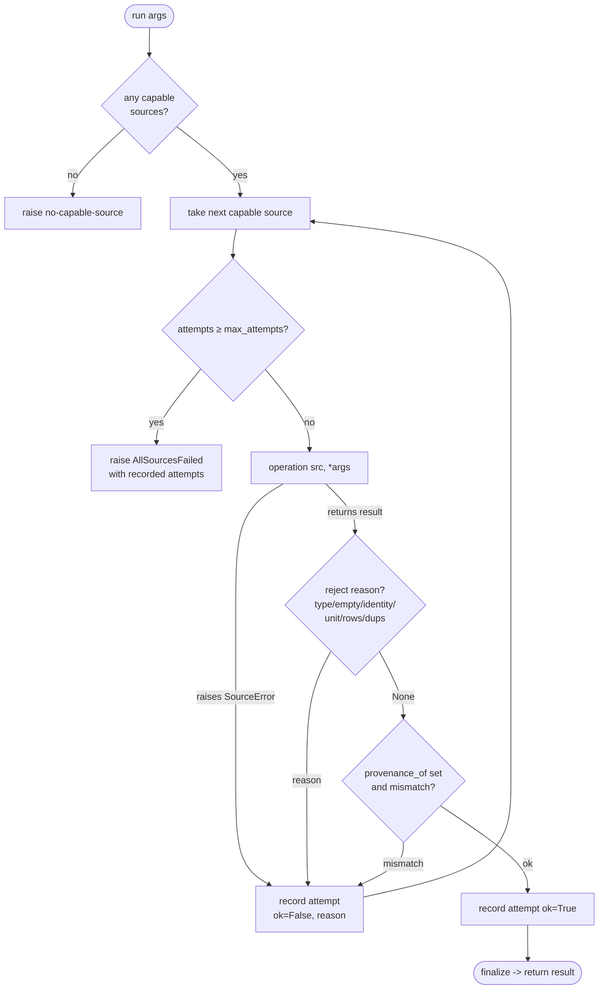

# Failover engine and validation (internal architecture)

> **Maintainer / internal doc.** This describes the generic failover engine, domain-client
> specializations, transport/cache layer, public input-validation helpers, and the private
> `_contracts` layer. Users see only the `SourceAttempt` / `AllSourcesFailed` surface
> documented in `docs/api.md` and `docs/how-to/errors.md`.

## The generic failover engine (`vnfin/failover.py`)

`FailoverClient` is the domain-agnostic core behind every vnfin failover client. A caller
supplies four small callables; the engine handles the rest:

| Callable param | Purpose |
|----------------|---------|
| `operation(source, *args)` | Fetch from ONE source — called once per attempt |
| `capability(source, *args) -> bool` | Whether a source can serve the request WITHOUT a network call. Incapable sources are skipped and do NOT count against `max_attempts`. |
| `reject(result, *args) -> str | None` | Accept/reject a returned result. Return a reason string to reject; `None` to accept. |
| `unit_of(source) -> hashable | None` | Declared unit/currency. Used by the unit-homogeneity guard at construction. |

Additional options:

| Param | Purpose |
|-------|---------|
| `provenance_of(result)` | Optional callable returning a result's stamped source name. When configured, a mismatch between the claimed provenance and the producing source is a rejected attempt. |
| `finalize(result, attempts, *args)` | Called with the accepted result and the full attempt list before returning. Used to attach attempt diagnostics and coverage warnings. |
| `on_unit_mismatch` | `"raise"` (default) or `"skip"` — what to do when a source in the chain declares a different unit from the chain's canonical unit. |
| `failure_factory` | Callable that builds the exception raised when all attempts are exhausted. |
| `no_capable_factory` | Callable that builds the exception raised when no source is capable of the request. |

### Execution flow

```
run(*args):
  capable = [s for s in sources if capability(s, *args)]
  if not capable: raise no_capable_factory(*args)

  for src in capable:
    if len(attempts) >= max_attempts: break
    try:
        result = operation(src, *args)
    except SourceError:
        record attempt (ok=False, reason=exception message)
        continue
    reason = reject(result, *args)
    if reason:
        record attempt (ok=False, reason=reason)
        continue
    if provenance_of:
        pmis = _provenance_mismatch(provenance_of(result), src.name)
        if pmis:
            record attempt (ok=False, reason=pmis)
            continue
    record attempt (ok=True, reason="ok")
    if finalize: return finalize(result, attempts, *args)
    return result

  raise failure_factory(attempts, *args)
```



### Unit-homogeneity guard

At construction, `_guard_units` iterates sources and collects declared units (non-`None`
from `unit_of`). If two sources declare different units the behaviour depends on
`on_unit_mismatch`:

- `"raise"` (default): `UnitMismatchError` raised immediately. Makes a unit mix
  structurally impossible, not merely unlikely.
- `"skip"`: sources with mismatched units are silently dropped from the chain.

### Provenance check (issue #126)

When `provenance_of` is configured, the engine verifies that the result's stamped source
matches the source that produced it. Two shapes are accepted:

- A `str` — must equal `source.name`.
- A `frozenset` — the COMPOSITE contract for multi-record results (e.g. fundamentals
  tuple-of-reports); every member must equal `source.name` and the set must be non-empty.

Everything else (missing, bare list, number) is rejected as malformed provenance.

### `_fetched_at_utc_reason` and `_warnings_reason`

Two shared result-metadata guards used by domain clients:

- `_fetched_at_utc_reason(value)` — `None` is allowed (optional metadata); a present
  value must be a timezone-aware UTC `datetime`. Any other type or offset is malformed.
- `_warnings_reason(warnings)` — must be `tuple[str, ...]`. A bare string, list, `None`,
  or a tuple with non-string members is malformed.

## Price client specialization (`vnfin/client.py`)

`FailoverPriceClient` wires the price domain into `FailoverClient`:

- `operation` → `source.get_history(symbol, interval, start, end)`
- `capability` → `source.supports(interval)` (interval-capability skip)
- `reject` → `_validate_price_result(...)` (detailed accept/reject logic)
- `unit_of` → `source.unit` (must be `"VND"`)
- `provenance_of` → `hist.source`
- `finalize` → attaches attempts + soft coverage warnings

Additionally, at construction it runs `_adjustment_policy_guard` to reject chains mixing
different adjustment policies (PROVIDER_ADJUSTED vs RAW vs MIXED).

**`_validate_price_result` checks (in order):**

1. `result_type_reason` — must be a `PriceHistory`
2. `non_empty_reason` — must have at least one bar
3. `_fetched_at_utc_reason` — freshness metadata shape
4. `_warnings_reason` — diagnostic metadata shape
5. Symbol and interval identity match
6. Unit and adjustment-policy chain match
7. Optional `exchange`/`provider_symbol` canonical string shape
8. `row_object_and_aware_datetime_reason` — each bar is a `PriceBar` with a tz-aware key
9. `strictly_ascending_reason` — bars strictly ascending by `time`
10. Per-bar OHLCV invariants: positive finite floats; non-negative integer volume; OHLC order
11. At least one bar in the requested date window

Coverage warnings (soft, non-failing) are appended in `_finalize`:
- `partial_start_coverage` — first bar >7 days after requested start
- `partial_end_coverage` — last bar >7 days before the expected latest trading day
  (VN trading-calendar aware via `calendar.expected_latest_trading_day`)

## Transport layer (`vnfin/transport.py`)

`HttpDataSource` is the shared HTTP transport base used by every adapter:

- **IPv4-forced httpx** — `local_address="0.0.0.0"` (datacenter IPv6 often blocked by VN/finance providers).
- **Browser User-Agent** — several feeds reject the default httpx UA.
- **Transport errors mapped to `SourceUnavailable`** — so the failover engine can recover.
- **Injectable `http_get`** — every adapter accepts an `http_get` callable for deterministic
  unit tests without network.

**Opt-in cache** (`cache_ttl=N`):
- In-memory dict keyed by `(url, params, json_body, headers)` — order-independent,
  normalized to JSON-sorted form.
- Secret values (api_key, token, Authorization, etc.) are redacted from the loggable
  key; their SHA-256 hashes participate in the key so different credentials never share
  a cached response.
- Default `cache_ttl=None` (no caching) keeps historical single-attempt behavior.

**Opt-in retry with jittered exponential backoff** (`max_retries=N`):
- Default `max_retries=0` (one attempt, no backoff — historical behavior unchanged).
- Transient failures: stdlib `ConnectionError`/`TimeoutError`, `httpx.TransportError`,
  HTTP 429/5xx → retried. Non-transient (4xx other than 429, etc.) → re-raised immediately.
- Delay: `base * 2**attempt` capped at `backoff_max`, then full-jittered.

**Secret redaction** (`redact_secrets`):
- Applied to all error messages, cache-key display portions, and log strings before they
  surface in `SourceUnavailable`.
- Covers URL query-string params, `Authorization` headers, and dict/JSON key-value pairs
  whose names match `SENSITIVE_PARAMS` (case/separator-insensitive).

## Public input validation (`vnfin/validation.py`)

Caller-facing validators that raise `InvalidData` (or `VnfinError`) for malformed inputs
before any source ever sees them:

| Function | Validates |
|----------|-----------|
| `validate_non_empty_string(value, name)` | Non-empty string (strips and checks) |
| `validate_date_range(start, end, *, allow_none, name)` | Both dates present (unless `allow_none`), comparable, and `start <= end` |
| `validate_positive_int(value, name)` | Positive int; rejects `bool` |
| `validate_country_iso3(value)` | Exactly three ASCII letters `[A-Z]{3}` after strip/upper |
| `validate_iso_date_string(value, label)` | `date`/`datetime` object or strict `YYYY-MM-DD` string (zero-padded) |
| `parse_canonical_int(value, label)` | Plain `int` or canonical base-10 string (`0` or `[1-9]\d*` — no sign, leading zeros, or fraction) |

`validate_country_iso3` shares the same `[A-Z]{3}` grammar as the private
`canonical_country_iso3` in `_contracts/keys.py`.

## TimeSeriesResult mixin (`vnfin/timeseries.py`)

A minimal mixin factoring `__len__`, `__iter__`, and `to_dataframe` out of every domain
result container. Concrete dataclasses declare three class attributes and implement two
methods:

- `_items_attr` — name of the field holding the row tuple (e.g. `"bars"`, `"points"`).
- `_index_column` — DataFrame index column name.
- `_df_columns` — full ordered list of DataFrame columns.
- `_row_record(item) -> dict` — map one row to a flat record.
- `_df_attrs() -> dict` — metadata stamped onto `df.attrs`.

`to_dataframe` raises `InvalidData` on duplicate index keys as a backstop (sources are
expected to reject duplicates earlier).

## The `_contracts` private layer

See `docs/architecture/provider-contracts.md` for the full detail. Summary:

- `vnfin/_contracts/` is a private package (underscore prefix); it is NOT public API.
- It provides two categories of tools:
  - **Provider-boundary primitives** (`fields.py`, `keys.py`, `rows.py`): used by adapters
    while parsing a raw provider response.
  - **Typed-result rules** (`results.py`, `timeseries.py`): used by failover clients to
    accept/reject a returned typed object.
- Key semantic invariant: **a missing key may be legacy-compatible; a present malformed
  key/value fails closed** unless the contract explicitly permits present-null.
