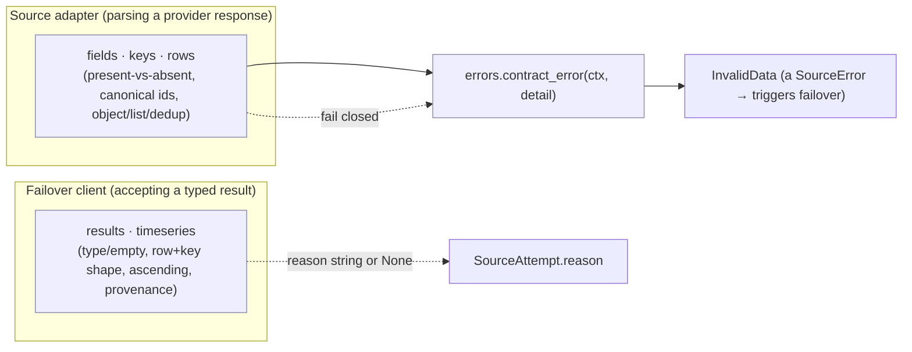

# Provider contracts (internal architecture)

> **Maintainer / internal doc.** `vnfin/_contracts/` is a **private** package — it is NOT
> public API and is not imported by users. This document explains the contract layer for
> maintainers; the public surface remains the documented facades in `docs/api.md`.

## Why this layer exists

A recurring family of bugs came from provider-boundary parsing implemented ad hoc in every
adapter and failover client:

1. **Truthiness collapse** — `row.get(k) or ""` erased a *present malformed* value
   (`None`/`False`/`[]`/`{}`/`""`) into "absent", which then got stamped as the requested
   identity/cadence.
2. **Broad stringification** — `str(raw).strip()` turned containers, booleans, floats, signed
   strings, padded strings, and leading-zero keys into plausible public identifiers.
3. **Adapter-local policy** — fixing one adapter didn't protect its siblings.
4. **Giant result validators** — each failover client repeated container/provenance/freshness/
   warnings/identity/row/sort/duplicate checks.

`vnfin/_contracts/` centralizes that policy so malformed-provider-data classes are structurally
hard to reintroduce, with **no public API change** and **behavior-preserving except fail-closed
on malformed provider data**.

## Layer boundaries

```
vnfin/_contracts/
  errors.py       contract_error(ctx, detail) -> InvalidData  ("<ctx>: <detail>")
  fields.py       MISSING sentinel; has_present_key / require_present / optional_present;
                  require_non_empty_str; optional_present_non_empty_str
  keys.py         canonical_provider_key; canonical_enum_tag; canonical_country_iso3;
                  canonical_security_symbol; canonical_fund_code;
                  canonical_crypto_asset; canonical_crypto_pair
  rows.py         require_object / require_list; reject_duplicate (atomic)
  results.py      result_type_reason; non_empty_reason
  timeseries.py   row_object_and_plain_date_reason; row_object_and_aware_datetime_reason;
                  strictly_ascending_reason
```

- **Provider-boundary primitives** (`fields`/`keys`/`rows`) are used by *adapters* while parsing a
  provider response, replacing raw `.get()` + `or` + `str()`.
- **Typed-result rules** (`results`/`timeseries`) are used by *failover clients* to accept/reject a
  returned typed object. Each rule returns a rejection **reason string** (recorded as a
  `SourceAttempt.reason`) or `None`; messages are parameterized so each domain keeps its exact
  wording.



## The core rule: absent vs present-malformed

> A **missing key** may be legacy-compatible (providers historically omit fields).
> A **present malformed** key/value **fails closed** unless the contract explicitly says
> present-null is meaningful.

Key presence is tested with `key in obj` (via `has_present_key` / `optional_present`), **never**
truthiness. `optional_present` returns the `MISSING` sentinel (distinct from a present `None`) so a
caller can allow an absent key while still rejecting present garbage.

## Canonical identifier grammars

| Helper | Grammar (after normalize) | Used for |
|--------|---------------------------|----------|
| `canonical_provider_key` | non-neg int / integral float / `[A-Za-z][A-Za-z0-9_]*` (or canonical digits) | line-item keys: `itemCode`, `Code`, `ratioCode` |
| `canonical_security_symbol` | `strip().upper()` → `[A-Z][A-Z0-9]*` | price symbols, index selectors, constituent `stockSymbol`, fundamentals caller symbol |
| `canonical_fund_code` | `strip().upper()` → `[A-Z][A-Z0-9]*` | Fmarket fund codes (separate wrapper so it can diverge) |
| `canonical_country_iso3` | `strip().upper()` → `[A-Z]{3}` | macro country args (WB/IMF/DBnomics) |
| `canonical_crypto_asset` | `strip(' ').upper()` → `[A-Z0-9]{2,15}` | crypto asset tokens |
| `canonical_crypto_pair` | `strip(' ').upper()` → `BTCUSDT` or `BTC-USD` (fullmatch) | crypto trading pairs (SHAPE only — quote validation is at the crypto client boundary) |
| `canonical_enum_tag` | `MISSING`→None if `missing_ok`; else canonical str in `allowed` | cadence tags: `reportType`, `ReportType` |

Notes:
- **Crypto vs security**: crypto pairs legitimately use hyphens/concatenation, so they use a
  separate grammar — never `canonical_security_symbol`. `canonical_crypto_pair` is shape-only;
  unknown-quote rejection lives in `crypto/client._normalize_crypto_symbol` (longest-known-quote).
- **`fullmatch`, never `match`+`$`** — `$` matches before a trailing `\n`, so `match` leaks
  newline-terminated values. Crypto helpers also `strip(' ')` (not full `.strip()`) so a trailing
  `\n`/`\t` cannot be normalized away into acceptance.
- The public `vnfin.validation.validate_country_iso3` shares the same `[A-Z]{3}` grammar.

## Adapter migration checklist

When migrating an adapter onto the contracts:

1. Replace `obj.get(k) or default` with `optional_present(obj, k)` + the `MISSING` check; decide
   per field whether a missing key is legacy-compatible or required (`require_present`).
2. Replace `str(raw).strip()` identifier handling with the matching canonical helper above.
3. Replace `isinstance` row/list guards with `require_object` / `require_list`; replace ad-hoc
   duplicate sets with `reject_duplicate`.
4. For enum/cadence tags, use `canonical_enum_tag` against the allowed set; decide whether a present
   valid-but-different tag is *skipped* (cadence mismatch) or *rejected*.
5. **Preserve byte-exact reason strings** where existing tests assert them — parameterize the rule
   (noun / key accessor / message) rather than hard-coding, and keep the original per-row check
   order (do not split a single-pass per-row loop into separate all-rows passes).
6. Behavior must be unchanged except **fail-closed on malformed provider data**. Run the full suite
   + public-API snapshot + docs-contract + no-secrets gates.

## Phase-4 adapter migrations completed

All domain adapters were migrated onto the `_contracts` primitives in Phase 4 (committed
and pushed as part of the full refactor):

| Batch | Adapters migrated | Issues closed |
|-------|------------------|---------------|
| Phase 2 | VNDirect + CafeF fundamentals | #44, #45, #21, #26 |
| Phase 4 batch 1 | Fmarket funds (`stockCode`/`fundCode`) | #33, #34 |
| Phase 4 batch 2 | Macro sources (WB/IMF/DBnomics/FRED) | #32, #48, macro #21 |
| Phase 4 batch 3 | Security/index identifiers (price + indices) | #30, #75 |
| Phase 4 batch 4 | Crypto/FX adapters | #9, #93 |
| Phase 4 batch 5 | Gold (PNJ silver exclusion + dedup) | #143 |
| Phase 4 + Phase 6 | Fundamentals symbol canonicalization close-loop | #142 |

## Test matrices

Shared negative/positive matrices live in `tests/test_contract_{fields,keys,rows,results,
timeseries}.py`. Adapter tests reuse the same malformed shapes (`""`, `"   "`, `None`, `[]`, `{}`,
`False`/`True`, numbers, internal-space/slash/punctuation/newline, signed/leading-zero) so every
adapter inherits the same regression coverage.

## Refactor status: COMPLETE

Phases 0–6 are fully implemented, reviewed (Checkpoint A–F), and pushed. The suite is
2705+ green (as of v0.2 + post-refactor feature milestones). Zero open bugs. Phase 6
closed the loop by re-verifying each parked issue against the contract tests and closing
them with refactor commit references.
