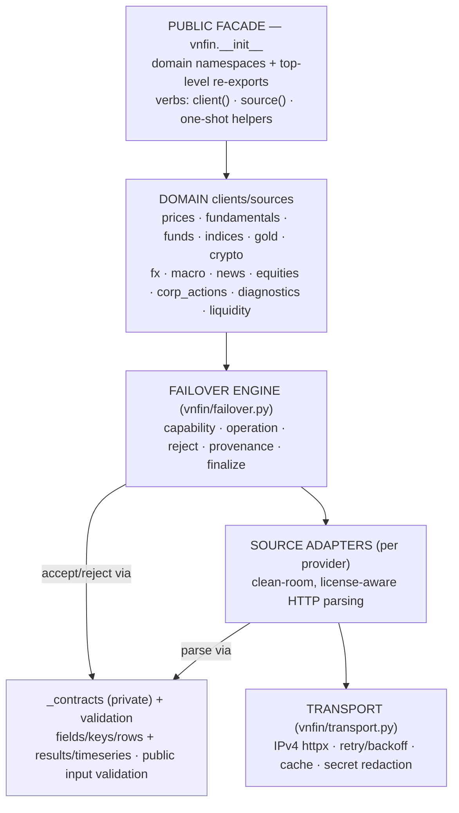

# System overview (internal architecture)

> **Maintainer / internal doc.** This describes the internal structure of `vnfin` for
> maintainers and contributors. The public API and user-facing docs live in `docs/api.md`
> and the tutorial/how-to pages under `docs/`.

## What this library is

`vnfin` is a clean-room, open-source Python library for Vietnam-market and macroeconomic
financial data. It targets **long-term investors, macroeconomic analysts, and tool
developers**. All sources are lawful and license-clear; VNStock/vnstock and any derived
material are permanently blacklisted (`docs/vnstock-blacklist.md`).

Version: `0.2.0` (`vnfin/__init__.py`). Stability policy: SemVer; public-API snapshot gate
at `tests/snapshots/public_api_v0_2_0.json`.

## Layer map (top to bottom)



The same layering as an ASCII reference:

```
┌─────────────────────────────────────────────────────────────────────────────┐
│  PUBLIC FACADE                                                              │
│  vnfin.__init__  — 14 domain namespaces + top-level re-exports              │
│  vnfin.prices / .fundamentals / .funds / .indices / .gold / .crypto        │
│  vnfin.fx / .macro / .news / .equities / .corp_actions                      │
│  vnfin.diagnostics / .liquidity / .exceptions                              │
│  Standard verbs: domain.client() · domain.source() · one-shot helpers       │
└─────────────────────────────────────────────────────────────────────────────┘
               |                             |
┌──────────────┴──────────────┐  ┌───────────┴──────────────────────────────┐
│  FAILOVER ENGINE             │  │  OFFLINE DOMAIN HELPERS                  │
│  vnfin/failover.py           │  │  vnfin/diagnostics.py  (preflight)       │
│  FailoverClient (generic)    │  │  vnfin/liquidity.py    (ADV/sizing)      │
│  FailoverPriceClient         │  └──────────────────────────────────────────┘
│  (price specialization)      │
│  unit-homogeneity guard       │
│  provenance check (#126)      │
│  fetched_at_utc/warnings chk │
└──────────────┬───────────────┘
               |
┌──────────────┴──────────────────────────────────────────────────────────────┐
│  DOMAIN CLIENTS (per-domain failover or single-source)                      │
│  fundamentals/client.py  FailoverFundamentalClient (VNDirect -> CafeF)      │
│  gold/failover.py        FailoverGoldClient (world XAU/USD daily)           │
│  indices/client.py       IndexClient  (price + constituents)                │
│  macro/client.py         MacroClient  (WorldBank -> IMF -> DBnomics + FRED) │
│  fx/client.py            FailoverFXClient (open.er-api -> Vietcombank)      │
│  crypto/client.py        FailoverCryptoClient (Binance -> Coinbase)         │
└──────────────┬───────────────────────────────────────────────────────────────┘
               |
┌──────────────┴───────────────────────────────────────────────────────────────┐
│  PROVIDER ADAPTERS (source adapters — one per endpoint/provider)             │
│  sources/: SSIiBoardSource, VNDirectSource, VPSSource, PinetreeSource, KIS  │
│  fundamentals/: VNDirectFundamentalSource, CafeFFundamentalSource           │
│  funds/: FmarketFundSource                                                   │
│  gold/: BTMCGoldSource, PNJGoldSource, GoldApiSource, CurrencyApiGoldSource │
│           StooqGoldSource                                                    │
│  indices/: VPSIndexSource, SSIIndexSource, VNDirectIndexSource,             │
│            SSIIndexSource (constituents)                                     │
│  macro/: WorldBankMacroSource, IMFDataMapperSource, DBnomicsSource,         │
│          FREDMacroSource (BYOK)                                              │
│  fx/: OpenErApiFXSource, VietcombankFXSource                                │
│  crypto/: BinanceCryptoSource, CoinbaseCryptoSource                         │
│  news/: AlphaVantageNewsSource (BYOK)                                       │
│  equities/: SsiIboardUniverseSource (SSI iBoard universe, #167)            │
│  corp_actions/: VsdcCashDividendSource (VSDC cash dividends, #163)         │
└──────────────┬───────────────────────────────────────────────────────────────┘
               |
┌──────────────┴───────────────────────────────────────────────────────────────┐
│  PRIVATE CONTRACT LAYER (INTERNAL — not public API)                          │
│  vnfin/_contracts/  — provider-boundary + typed-result contracts             │
│  errors.py · fields.py · keys.py · rows.py · results.py · timeseries.py    │
│  See docs/architecture/provider-contracts.md for full detail.               │
└──────────────┬───────────────────────────────────────────────────────────────┘
               |
┌──────────────┴───────────────────────────────────────────────────────────────┐
│  SHARED INFRASTRUCTURE                                                       │
│  vnfin/transport.py   HttpDataSource base (IPv4-forced, UA-stamped,          │
│                       secret-redacting, opt-in cache + retry)                │
│  vnfin/validation.py  Public caller-input validators (InvalidData)           │
│  vnfin/exceptions.py  Exception hierarchy                                    │
│  vnfin/models.py      PriceBar, PriceHistory, SourceAttempt, Interval, ...  │
│  vnfin/timeseries.py  TimeSeriesResult mixin (to_dataframe, __len__/iter)   │
│  vnfin/coerce.py      Type-coercion helpers                                  │
│  vnfin/calendar.py    Trading-calendar helpers                               │
└──────────────────────────────────────────────────────────────────────────────┘
```

## Public facade shape

`import vnfin` exposes 14 domain namespaces and a small set of top-level names:

```python
# Domain namespaces (one obvious entry per domain)
vnfin.prices        vnfin.fundamentals   vnfin.funds        vnfin.indices
vnfin.gold          vnfin.crypto         vnfin.macro        vnfin.fx
vnfin.news          vnfin.equities       vnfin.corp_actions
vnfin.diagnostics   vnfin.liquidity      vnfin.exceptions

# Top-level re-exports (long-standing stable surface)
vnfin.FailoverPriceClient   vnfin.FailoverClient
vnfin.PriceHistory          vnfin.PriceBar         vnfin.SourceAttempt
vnfin.Interval              vnfin.AdjustmentPolicy
vnfin.default_client()
```

Standard factory verbs (consistent across all standard domains):

| Verb | Returns | Notes |
|------|---------|-------|
| `domain.client(...)` | Domain failover client | Recommended entry; multi-source, unit-homogeneity guard |
| `domain.source(...)` | Primary single adapter | No failover; pin one provider explicitly |
| one-shot helpers | Domain result | `prices.history`, `fx.get_rate`, `macro.get_indicator`, `fundamentals.get_financials` |

`gold` is the documented exception: VN domestic (VND/luong) and world XAU (USD/oz) are
different unit families so `gold` exposes `vn(provider)` / `world(provider)` / `source(provider)`
instead of a single `client()`. See `docs/api.md` for the rationale.

`funds.client` is an alias of `funds.source` (accepted single-source in v0.2; no clean
no-auth backup yet).

Offline helper namespaces (`diagnostics`, `liquidity`) have their own API described in
`docs/api.md` and `docs/architecture/data-domains.md`.

## Version and public-API snapshot

- `vnfin.__version__ == "0.2.0"` (`pyproject.toml` locked to the same value by
  `tests/test_public_api_surface.py::test_version_lockstep_pyproject_matches_dunder`).
- `scripts/dump_api_surface.py` introspects every `DOMAIN_MODULES` namespace and emits a
  JSON snapshot. The committed baseline lives at
  `tests/snapshots/public_api_v0_2_0.json`.
- `tests/test_public_api_surface.py` enforces no breaking changes relative to the baseline;
  additive changes are printed and folded in consciously at release time.

## Exception hierarchy

```
VnfinError
  SourceError                # recoverable single-source failures (trigger failover)
    SourceUnavailable        # transport / network failure
    EmptyData                # source responded; no usable rows
    InvalidData              # malformed / self-inconsistent data
  UnsupportedInterval        # capability signal (skipped, not failed)
  AdjustmentPolicyError      # non-homogeneous adjustment policies
  UnitMismatchError          # mismatched units in a failover chain
  AllSourcesFailed           # all attempts exhausted (carries per-source diagnostics)
```

`SourceError` subclasses are the failover trigger: the `FailoverClient` engine catches them,
records the attempt as a `SourceAttempt`, and tries the next source. `UnsupportedInterval`
is a capability signal — adapters raise it when they cannot serve an interval, and the
engine skips them without counting an attempt.

## Feature-scope policy

- Target audience: **long-term investors and macro analysts** (daily, weekly, monthly
  granularity; multi-year history).
- Daily (`D1`) is the guaranteed common denominator across all data domains.
- Intraday intervals (`M1`/`M5`/`M15`/`M30`/`H1`) are enumerated and capability-gated per
  source, but carry no service-level guarantee. New intraday sources require strong
  justification before inclusion.
- Real-time second/minute feeds are out of scope and must not be added without explicit Boss
  approval. The `Interval` enum does NOT include sub-minute values.
- Sources must be official-provider or license-clear; no scraping of paywalled or legally
  ambiguous endpoints.

## Test suite overview

- Full suite: ~2705 tests (as of v0.2 + Phase 6 complete), all passing.
- `tests/test_contract_{fields,keys,rows,results,timeseries}.py` — private `_contracts`
  layer matrix tests.
- `tests/test_docs_contract.py` — documented-facade invariants (offline, no network).
- `tests/test_public_api_surface.py` — public-API snapshot + comparator.
- `tests/test_no_secrets.py` — secret-leak scan on error strings.
- Domain adapter tests use synthetic UDF fixtures committed to the repo; no real broker
  rows are bundled. Integration tests that hit live endpoints are opt-in and skipped in CI.

## Key design choices (why)

| Choice | Rationale |
|--------|-----------|
| One domain namespace per data type | Avoids incompatible return types through one generic client |
| Unit-homogeneity guard at construction | Makes silent unit mixes structurally impossible |
| Provenance check on every accepted result | Prevents a primary returning a backup's label; enables trustworthy audit |
| `_contracts/` private package | Centralizes provider-boundary policy; adapters import helpers instead of re-implementing guards |
| Injectable `http_get` on every adapter | Deterministic unit tests without network; no VCR cassettes needed for contract coverage |
| `TimeSeriesResult` mixin | Removes boilerplate `__len__`/`__iter__`/`to_dataframe` from every result dataclass |
| `MISSING` sentinel | Distinguishes absent key (legacy-compatible) from present-null (fail-closed) |
